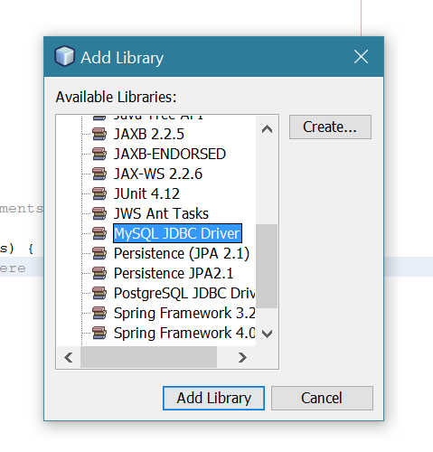
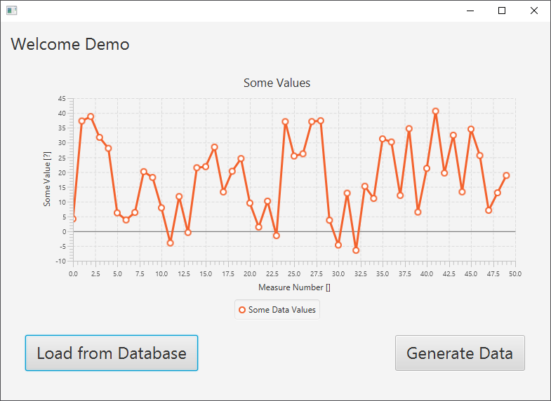

# MySQL Database Connection from Java

## Importing MySQL JDBC driver

If you are using Netbeans, the MySQL JDBC \(Java DataBase Connectivity\) driver is already installed on your system. You only need to import it into you project.

Open your project in the `Projects` window. Right-click on the `Libraries` folder and select `Add Library...`

In the list with available libraries, find and select the `MySQL JDBC Driver`, and click on the `Add Library` button.

The library is now available in your project.

## XAMPP

If you have XAMPP installed you are fine. Otherwise you will need to install it and start the Apache and MySQL services.

## Database Setup

Navigate to `http://localhost/phpmyadmin/` and import the `biometric_database.sql` that can be found in this projects subdirectory `assets/mysql`. It will create a basic database for temperature values and users. A demo user will be create with the name `Demo`, the email `demo@vives.be` and the password `demo`.

## Launching the App

When launching the app you can register a new user or login with the demo user. When you press the `Load from Database` button, the available data will be displayed in the graph.

